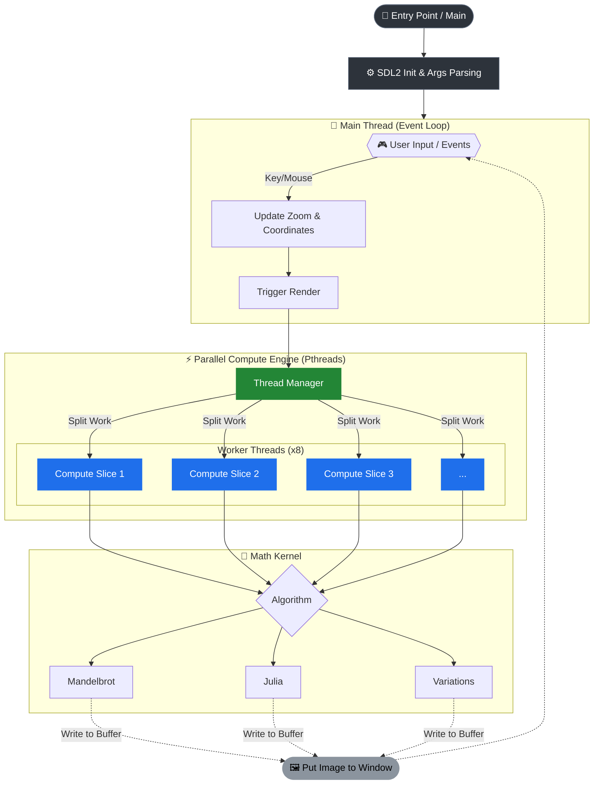

# 🚀 Fract-ol - Interactive Fractal Renderer


---

## 🧠 Description

**Fract-ol** allows you to explore mathematical beauty in real-time. By leveraging **multi-threading (pthreads)** and optimized arithmetic, it renders complex sets like Mandelbrot and Julia with smooth zoom capabilities.

The project demonstrates mastery of **low-level optimization**, **memory management**, and **graphics programming**.

---

## 🧩 Table of Contents

- [Description](#-description)
- [Features](#-features)
- [Technologies Used](#%EF%B8%8F-technologies-used)
- [Architecture](#%EF%B8%8F-architecture)
- [Project Structure](#-project-structure)
- [Installation](#-installation)
- [Execution](#%EF%B8%8F-execution)
- [Configuration](#%EF%B8%8F-configuration)
- [Usage and Examples](#-usage-and-examples)
- [Demo](#-demo)
- [Documentation](#-documentation)
- [Known Issues / ToDo](#-known-issues--todo)
- [Learnings and Future Improvements](#-learnings-and-future-improvements)
- [Credits and Acknowledgments](#-credits-and-acknowledgments)
- [License](#-license)
- [Author](#%E2%80%8D-author)

---

## 🌟 Features

- ✅ **Real-time rendering**: Multi-threaded fractal computation for responsive interaction
- ✅ **Interactive zoom**: Cursor-centered zoom with mouse wheel
- ✅ **Dynamic color schemes**: Multiple color palettes including HSV mapping and psychedelic effects
- ✅ **High performance**: Parallel rendering with 8 simultaneous workers
- ✅ **Complex mathematics**: Complex number arithmetic including trigonometric operations
- ✅ **Multiple fractals**: Classic Mandelbrot, Julia, Eye Mandelbrot, Sinh Mandelbrot, and Dragon Mandelbrot
- 🔄 **Future improvements**: Performance optimizations for extreme zooms, more fractal variations

---

## ⚙️ Technologies Used

| Category | Technology |
|-----------|-----------|
| **Language** | C (C99 standard) |
| **Compiler** | GCC / Clang |
| **Graphics** | SDL2 (Simple DirectMedia Layer 2) |
| **Parallelism** | POSIX Threads (pthread) |
| **Mathematics** | Complex number arithmetic, trigonometric calculations |
| **Tools** | Make, Doxygen (documentation) |
| **Operating System** | Linux (verified) |

---

## 🏗️ Architecture

The application is structured into specialized modules:

### Main Modules:

**Complex Number Operations** (`src/complex/`):
- Arithmetic operations: multiplication, addition, division, inversion
- Complex trigonometric functions (hyperbolic sine)
- Modulus calculation for divergence detection

**Fractal Rendering** (`src/fractals/`):
- **Mandelbrot Set**: $$z_{n+1} = z_n^2 + c$$ where $$c$$ is the pixel coordinate
- **Julia Set**: $$z_{n+1} = z_n^2 + c$$ with customizable fixed parameter $$c$$
- **Eye Mandelbrot**: Variation of mandelbrot with $$z_{n+1} = z_n^3 + 1/c$$ equation
- **Sinh Mandelbrot**: Mandelbrot variation using hyperbolic sine $$z_{n+1} = sinH(z_n/c)$$
- **Dragon Mandelbrot**: A complex mandelbrot variation using hyperbolic sine $$z_{n+1} = sinH(z_n) + 1/c^2$$

**Utilities** (`src/utils/`):
- Image management and pixel buffer
- Color schemes and HSV mapping
- Event handling and user input

**Survival Library** (`lib/survival_lib/`):
- Custom utility functions: string handling, memory, conversions
- Custom printf with format support
- Reusable low-level abstractions

### Execution Flow:
1. SDL2 initialization and window creation
2. Argument parsing to select fractal type
3. Spawn worker threads for parallel computation
4. Main event loop: capture input, update zoom/parameters
5. Rendering: each worker computes a fractal section
6. Screen presentation and synchronization



---

## 📂 Project Structure

```
fract-ol/
├── include/                         # Main headers
│   ├── fract_ol.h                   # Main definitions and structures
│   └── survival_lib.h               # Custom library headers
├── src/                             # Source code
│   ├── main.c                       # Entry point and initial setup
│   ├── complex/                     # Complex number operations
│   │   ├── complex_operations.c     # Addition, subtraction, multiplication, division
│   │   └── complex_trigonometric.c  # Hyperbolic sine and trigonometric functions
│   ├── fractals/                    # Fractal rendering algorithms
│   │   ├── fractal_render.c         # Main rendering engine
│   │   ├── mandelbrot.c             # Mandelbrot set implementation
│   │   ├── julia.c                  # Julia set implementation
│   │   ├── eye_mandelbrot.c         # Eye variation (z³)
│   │   ├── sinh_mandelbrot.c        # Sinh variation
│   │   └── dragon_mandelbrot.c      # Dragon variation
│   └── utils/                       # Utilities
│       ├── color.c                  # Color palettes and HSV mapping
│       ├── handlers.c               # Event handlers
│       ├── img_manag.c              # Pixel buffer management
│       └── string.c                 # Auxiliary string functions
├── lib/
│   └── survivalib.a                 # Custom utility library
├── Makefile                         # Project compilation
├── Doxyfile                         # Documentation configuration
├── LICENSE                          # GPL3 License
└── README.md                        # This file
```

## 📦 Installation

### 🔧 Prerequisites

- **Compiler**: GCC or Clang with C99 support
- **Build system**: GNU Make
- **Graphics**: SDL2 (Simple DirectMedia Layer 2)
- **Operating system**: Linux (or POSIX Threads compatible)

**Optional:**
- **Doxygen**: To generate documentation locally

#### On Debian/Ubuntu:
```bash
sudo apt-get update
sudo apt-get install build-essential libsdl2-dev
# Optional - for documentation
sudo apt-get install doxygen
```

#### On Fedora/RHEL:
```bash
sudo dnf install gcc make SDL2-devel
# Optional - for documentation
sudo dnf install doxygen
```

#### On macOS (with Homebrew):
```bash
brew install sdl2
# Optional - for documentation
brew install doxygen
```

### 💾 Installation Steps

1. **Clone the repository**:
```bash
git clone https://github.com/Alelith/fract-ol.git
cd fract-ol
```

2. **Compile the project**:
```bash
make
```

3. **Compile with documentation (optional)**:
```bash
make docs
```

The `fractol` executable will be generated in the root directory.

---

## ▶️ Execution

The application is run from the command line by specifying the type of fractal to render:

```bash
./fractol mandelbrot
./fractol julia <real_part> <imaginary_part>
./fractol eye
./fractol sinh
./fractol dragon
```

### Examples:

```bash
# Render the classic Mandelbrot set
./fractol mandelbrot

# Render a Julia set with parameters C = 0.285 + 0.01i
./fractol julia 0.285 0.01

# Render variations
./fractol eye
./fractol sinh
./fractol dragon
```

### Controls:

| Control | Action |
|---------|--------|
| **Mouse wheel up** | Zoom in (cursor-centered) |
| **Mouse wheel down** | Zoom out |
| **ESC** | Close the application |
| **Mouse movement** | Updates information in real-time during zoom |

## ⚙️ Configuration

### Compilation Parameters

The Makefile includes several useful targets:

```bash
make              # Compile the project
make clean        # Remove object files
make fclean       # Complete cleanup (object files and executable)
make re           # Complete cleanup and recompilation
make docs         # Generate documentation with Doxygen
```

### Program Variables

The following parameters can be configured at compile time (by editing `include/fract_ol.h`):

- **WIDTH / HEIGHT**: Window dimensions (default: 1920x1440)
- **MAX_ITERATIONS**: Maximum number of iterations to calculate divergence (default: 256)
- **NUM_THREADS**: Number of workers (default: 8)

---

## 🧪 Usage and Examples

### Exploring the Mandelbrot Set

1. Run: `./fractol mandelbrot`
2. Use the mouse wheel to zoom
3. Zoom in on interesting regions to see fractal self-similarity

### Playing with Julia Sets

Different parameters produce completely different visual sets:

```bash
# Fire spiral
./fractol julia -0.7 0.27015

# Jagged set
./fractol julia -0.4 0.6

# Galaxy
./fractol julia -0.162 1.04
```

### Comparing Variations

```bash
# Classic Mandelbrot
./fractol mandelbrot

# Mandelbrot with Z³ (Eye)
./fractol eye

# Mandelbrot with hyperbolic sine
./fractol sinh

# Dragon Mandelbrot
./fractol dragon
```

### Typical Workflow

1. Select fractal type
2. Identify interesting region
3. Zoom gradually to explore details
4. Observe how different color schemes reveal distinct structures

---

## 📸 Demo

> **📝 Note**: It's recommended to run the program and interactively explore the different fractals. Each screenshot has unique characteristics depending on the zoom level and parameters used.

### Implemented Fractals:

- **Mandelbrot Set**: The classic Mandelbrot set with infinite self-similar structure
  

https://github.com/user-attachments/assets/b415d0cf-e73e-4507-b9a2-bccfc57be974


- **Julia Set**: Complex sets generated by customizable parameters
  

https://github.com/user-attachments/assets/59284491-8a53-4aa2-b1ce-2164bd285ec1


- **Eye Mandelbrot**: Distinctive visual variation with z³ iteration
  

https://github.com/user-attachments/assets/8516ffbc-ec00-4f4b-b1cf-45ebe37043e4


- **Sinh Mandelbrot**: Unique visualization using hyperbolic functions
  

https://github.com/user-attachments/assets/5c6d36d1-93af-4d0a-898a-fa887c4089cc


- **Dragon Mandelbrot**: Another fascinating variation of the classic set
  

https://github.com/user-attachments/assets/b82cd6d5-9639-405e-9221-4210e9560d5e


---

## 📖 Documentation

The complete code documentation is generated with Doxygen. You can access it at:

🔗 **[Code Documentation](https://alelith.github.io/fract-ol-Documentation/)**

To generate the documentation locally:
```bash
make docs
```

The documentation includes:
- **Detailed description** of all functions and macros
- **Relationship diagrams** between modules
- **Usage examples** of internal APIs
- **Modular architecture guide**
- **Technical specifications** for each function
- **Warnings and notes** about special behavior

---

## 🐞 Known Issues / ToDo

### Known Issues:

| Severity | Description | Status |
|-----------|-------------|--------|
| 🟡 Medium | Performance degradation with extreme zooms (>100x) | Open - Requires optimization |

### Planned Future Improvements:

- [ ] Performance optimization for ultra-deep zooms
- [ ] More fractal variations (Tricorn, Burning Ship, etc.)
- [ ] Zoom animation recording mode
- [ ] Customizable color palette at runtime
- [ ] High-resolution image export
- [ ] Full multi-platform support (macOS, Windows)

---

## 🧭 Learnings and Future Improvements

### 📚 Main Learnings

1. **Graphics Programming in C**: Mastery of SDL2 for real-time rendering
   - Event management, pixel buffer, and screen synchronization
   - Performance optimization in graphics computing

2. **Fractal Mathematics**: Deep understanding of Mandelbrot and Julia sets
   - Complex numbers and complex arithmetic
   - Iteration algorithms and divergence detection
   - Visualization of infinite mathematical structures

3. **Concurrent Programming**: Implementation of parallel rendering
   - POSIX Threads for multi-threaded computing
   - Thread synchronization without race conditions
   - Efficient division of computational work

4. **Memory Management in C**: Robust allocation and deallocation practices
   - Memory profiling under load
   - Data structure optimization

### 🚀 Considered Future Improvements

- **Performance**: Investigate SIMD (SSE/AVX) for complex calculation vectorization
- **More Fractals**: Tricorn, Burning Ship, Newton fractals
- **Interactivity**: Real-time parameter interface
- **Portability**: Verify compatibility with macOS and Windows
- **Visualization**: 3D modes, depth mapping, fractal raytracing

---

## 🤝 Credits and Acknowledgments

- **Fractal Mathematics**: Based on theory by Benoit Mandelbrot and Gaston Julia
- **SDL2**: Simple DirectMedia Layer - Cross-platform graphics library
- **References**: 
  - [Wikipedia - Mandelbrot set](https://en.wikipedia.org/wiki/Mandelbrot_set)
  - [Wikipedia - Julia set](https://en.wikipedia.org/wiki/Julia_set)
  - [SDL2 Documentation](https://wiki.libsdl.org/)

---

## 📜 License

This project is licensed under the **GNU General Public License v3 (GPL3)** - see the [LICENSE](LICENSE) file for more details.

The GPL3 license requires:
- 📋 Include license and copyright notice
- 📝 Document changes made
- 📦 Source code availability
- 🔄 Changes under the same license

Any derivative work must be distributed under the same GPL3 license.

---

## 👩‍💻 Author

**Lilith Estévez Boeta**

Backend & Multiplatform Developer  
📍 Málaga, Spain  
🔗 [GitHub](https://github.com/Alelith) · [LinkedIn](https://www.linkedin.com/in/alelith/)

---

<p align="center">
  <b>⭐ If you like this project, don't forget to leave a star on GitHub ⭐</b>
</p>
